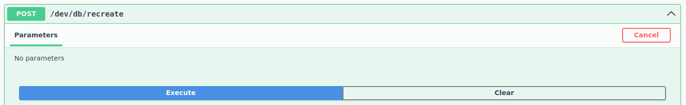
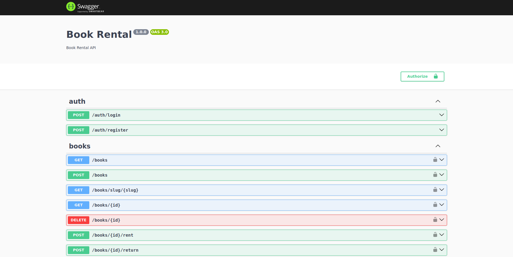

# Book Rental

Uma aplicação para alugar livros.

## Funcionalidades

- Cadastrar e entrar com um usuário
- Cadastrar livros
- Listar livros aplicando filtros e paginação
- Ver detalhes de livros
- Alugar/Devolver livros
- Excluir livros

## Tecnologias

- React.JS (web)
- Nest.JS (api)

## Requisitos básicos

- Node.JS (16 ou superior)

## Como executar?

### Com Docker

- Execute `docker-compose up -d`.
- A este ponto a api deve estar rodando em [http://localhost:3000/](http://localhost:3000/) e a web em [http://localhost:8080/](http://localhost:8080/)
- Porém, o banco de dados não está populado.
- Se quiser inserir dados de teste vá até [http://localhost:3000/docs](http://localhost:3000/docs).
- 
- E clique em "Execute", esta rota de desenvolvimento recria e aplica um seed no banco de dados.
- Você pode criar uma conta ou entrar com o usuário:
  - Email: `test@mail.com`
  - Senha: `password`

### Sem Docker

- Crie um arquivo `.env` em `api/.env` com os seguintes dados:
  ```
  DB_HOST=localhost
  DB_PORT=5432
  DB_USER=user
  DB_NAME=bookrental
  DB_PASSWORD=pass
  JWT_SECRET=secret
  ```
- Vá em `api`, execute `npm i` e depois `npm start`
- Vá em `web`, execute `npm i` e depois `npm start`
- A este ponto a api deve estar rodando em [http://localhost:3000/](http://localhost:3000/) e a web em [http://localhost:8080/](http://localhost:8080/)

# Documentação da API

É possível acessar a documentação de todas as rotas em [http://localhost:3000/docs](http://localhost:3000/docs) após inicializar a api.



# Testes

Foram feitos alguns poucos testes de integração na api em algumas rotas do `/books/*`.

Para rodar, basta ter o backend rodando, acesse a pasta `tests`, execute `npm i` e depois `npm t`.

Casos cobertos:
- Listar livros com filtros de nome, autor e ano de publicação.
- Alugar livro
- Devolver livro

Inicialmente sempre é chamada a rota `/dev/db/recreate` para resetar o banco de dados e inserir dados de teste.


# Formatação

Execute `npm run format` na raiz do projeto para formatar o código.
